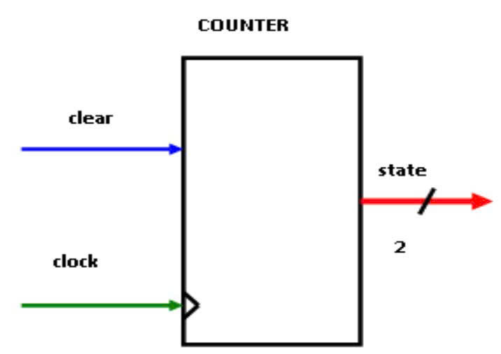
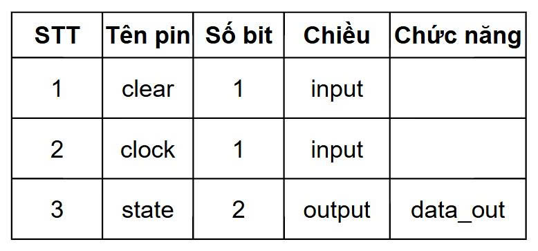

# Module counter

Sơ đồ mạch:

Bộ đếm lên 2 bit đồng bộ với tín hiệu reset không đồng bộ, tích cực mức cao. Chức năng: (1) đếm lên theo cạnh lên của clock, (2) Reset về 0 ngay lập tức khi clear = 1.